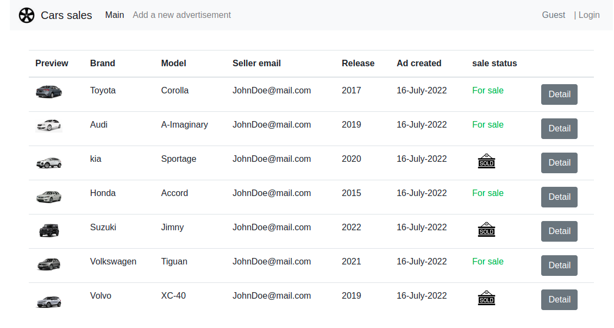
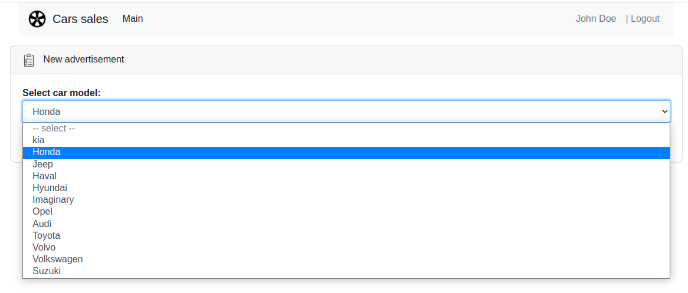
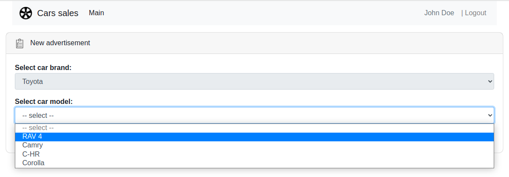
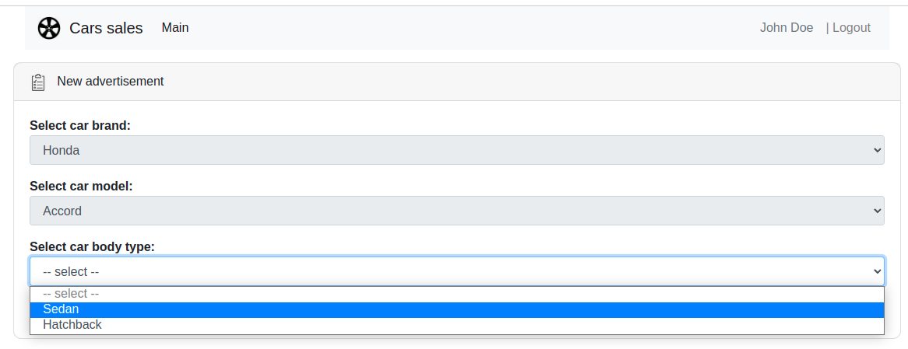
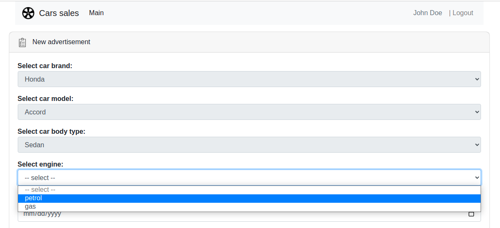
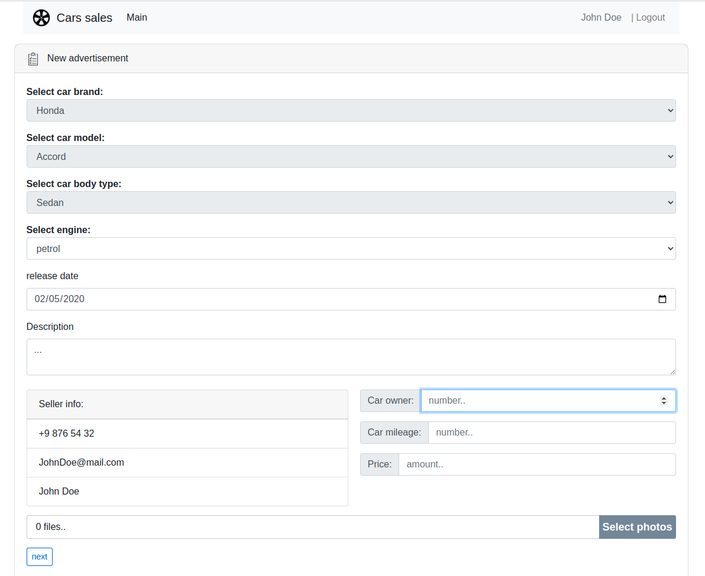
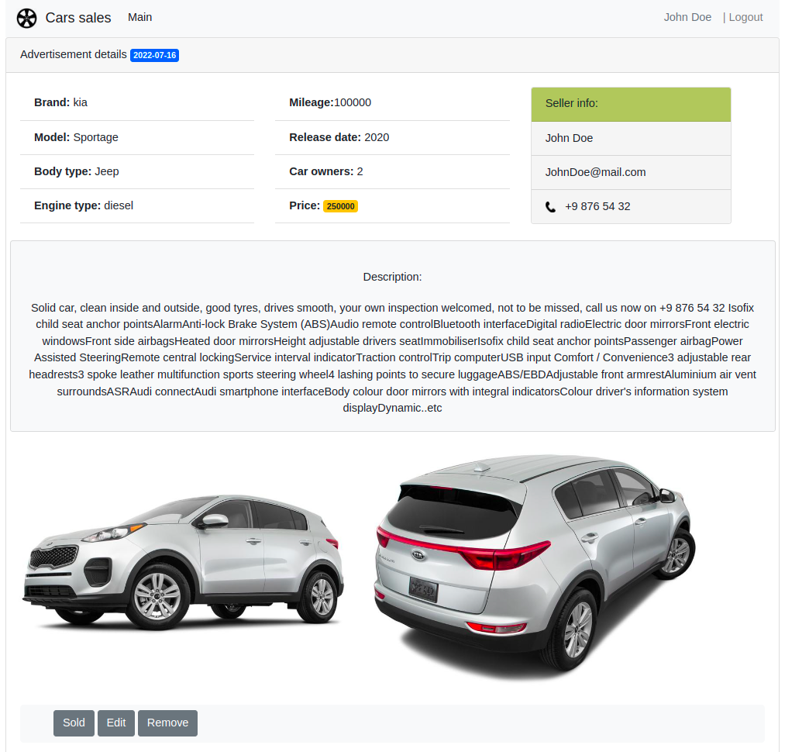

# Spring Boot app
<h2>Used car sales service</h2>

<h2>Technologies</h2>
<ul>
    <li>Spring Boot</li>
    <li>Spring MVC</li>
    <li>Bootstrap</li>
    <li>Thymeleaf</li>
    <li>Hibernate</li>
    <li>Postgres</li>
    <Li>liquibase</Li>
</ul>

### 1. Main page. List of all advertisements.

### 2. The page for adding a new advertisement (authenticated users)
###   2.1 first, user must select a brand (from existing data)

###   2.2 next, user need to choose a model of the car available for the brand

###   2.3 next, select a car body type 

###   2.4 next, an engine type

###   2.5 and all others attributes

### 3. detailed description of the ad (the author of the ad can edit, delete or set the status sold)

