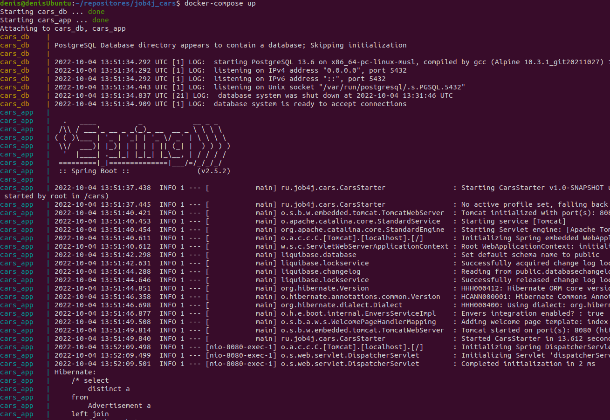
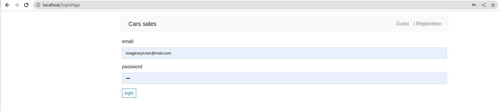
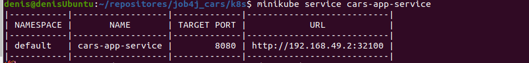
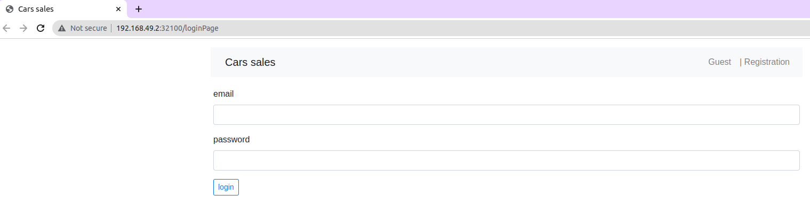

[](https://github.com/DenisYakovinov/job4j_cars/actions/workflows/maven.yml)
# Spring Boot app
<h2>Used car sales service</h2>

<h2>Technologies</h2>
<ul>
    <li>Spring Boot</li>
    <li>Spring MVC</li>
    <li>Bootstrap</li>
    <li>Thymeleaf</li>
    <li>Hibernate</li>
    <li>Postgres</li>
    <Li>liquibase</Li>
</ul>

### 1. Main page. List of all advertisements.

### 2. The page for adding a new advertisement (authenticated users)
###   2.1 first, user should select a brand (from existing data)

###   2.2 next, user need to choose a model of the car available for the brand

###   2.3 next, select a car body type 

###   2.4 next, an engine type

###   2.5 and all others attributes

### 3. detailed description of the ad (the author of the ad can edit, delete or set the status sold)


Running via Docker Compose

1. clone the project
```
https://github.com/DenisYakovinov/job4j_cars.git
```
2. go to the project root:
```
cd job4j_cars
```
3. then build the application:
```
docker-compose build
```
4. and run db and app
```
docker-compose up
```
6. then move to localhost/index



# Running in a K8s cluster
* docker, kubectl, minikube must be pre-installed on your computer
* from the project root:

1. create secret:
```
kubectl apply -f k8s/postgresdb-secret.yml
```
2. create configMap:
```
kubectl apply -f k8s/postgresdb-configmap.yml
```
3. create database deployment:
```
kubectl apply -f k8s/postgresdb-deployment.yml
```
4. create spring boot app deployment:
```
kubectl apply -f k8s/carsapp-deployment.yml
```
5. get the URL where we can connect to the service from outside.
```
minikube service spring-boot-service
```
 <br>
and open login page
 <br>